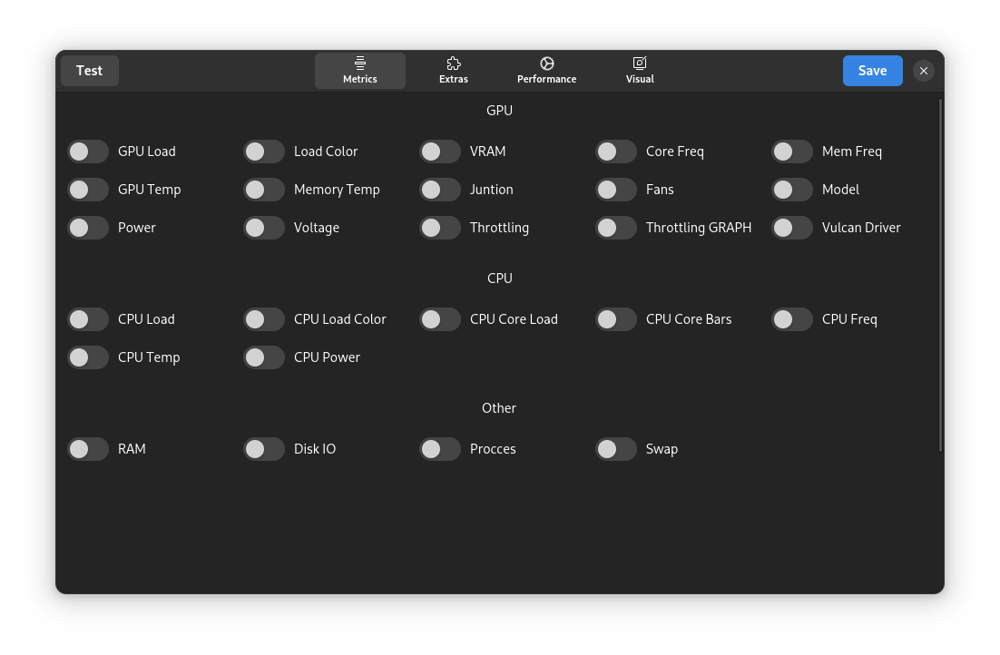
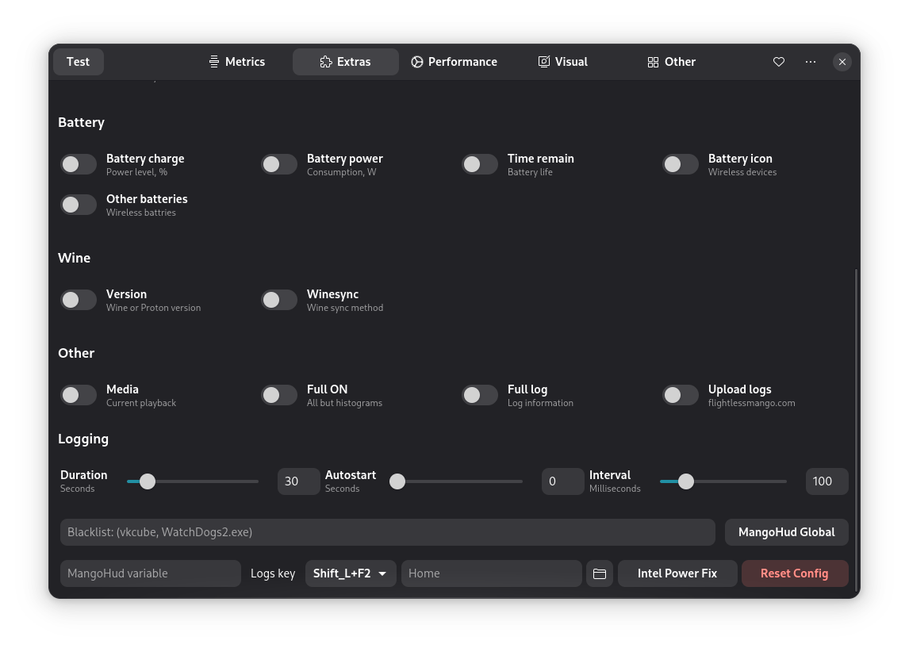
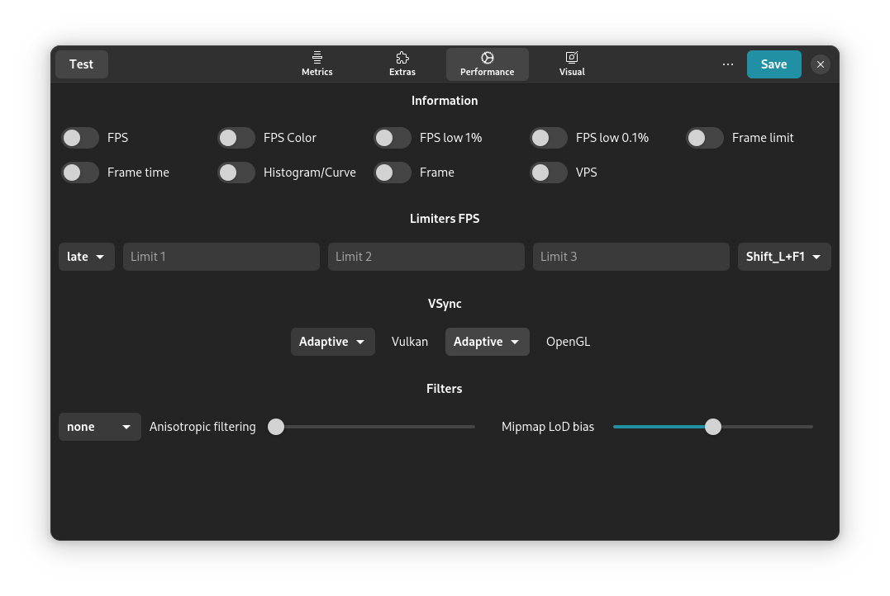
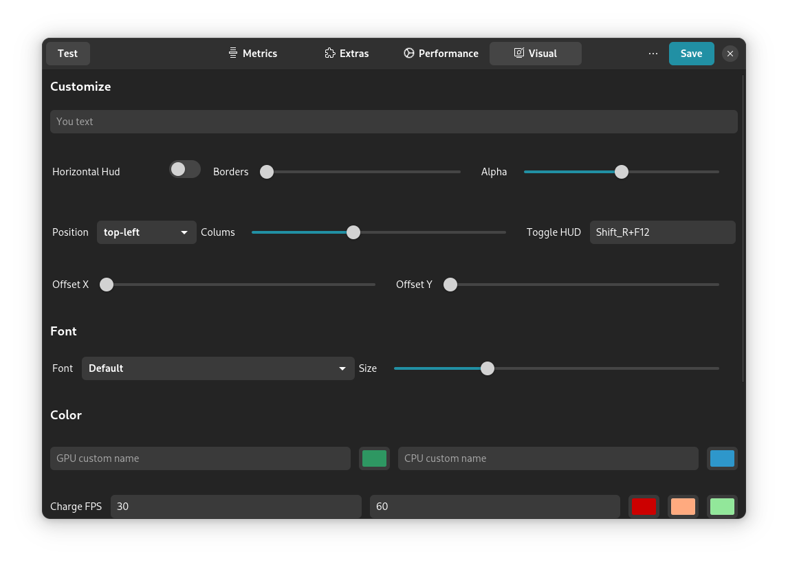

## MangoJuice   [](README.md) [](docs/README-ru.md)

### This program will be a convenient alternative to Goverlay for setting up Mangohud.

<p align="center">
    
</p>


Page 1 | Page 2 | Page 3 | Page 4
:-:|:-:|:-:|:-:
 |  |  |  

## Repositories:
[](https://repology.org/project/mangojuice/versions)

## Building the source code

#### Dependencies:
* `gtk4`
* `libadwaita-1`
* `gio-2.0`
* `mangohud`
* `mesa-demos`
* `vulkan-tools`

#### Build utilities:
* `meson`
* `ninja`
* `cmake`
* `gcc`
* `valac`

### Building:

#### latest
> [!NOTE]
> The functionality is currently being improved.
```shell
meson setup build
```

### Install:
```shell
sudo ninja -C build install
```

### Uninstall:
```shell
sudo ninja -C build uninstall
```

## Support:

You can support in several ways:
- Create an issue with a problem or a suggestion for improvement
- Submit a merge request with a fix or new functionality
- Support financially (Please include your nickname in the "Message to the recipient" when sending via T-Bank)

<br>

<div align="center">
  <a href="https://boosty.to/radiolamp/donate">
    
  </a>
  <a href="https://www.tbank.ru/cf/1J1DvYNesgD">
    
  </a>
</div>


## Gratitude:
Thank you [Rirusha](https://gitlab.gnome.org/Rirusha). For important clarifications about Vala and GTK4.

### Projects that have become muses:
 - [`Mangohud`](https://github.com/flightlessmango/MangoHud)
 - [`Goverlay`](https://github.com/benjamimgois/goverlay)
 - [`Colloid`](https://github.com/vinceliuice/Colloid-icon-theme/) 

### Attention, this is my first project on GTK4 + Vala, so please treat with understanding.
