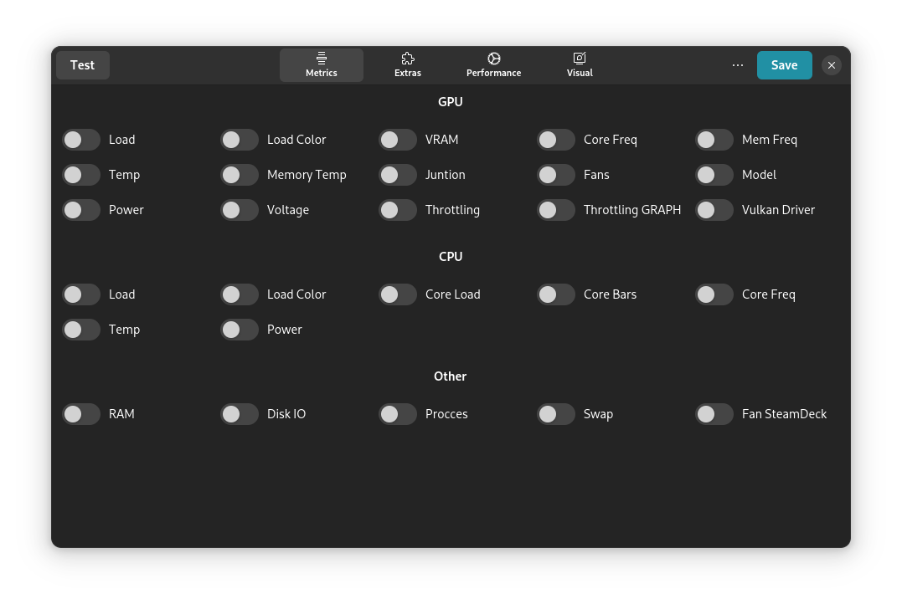
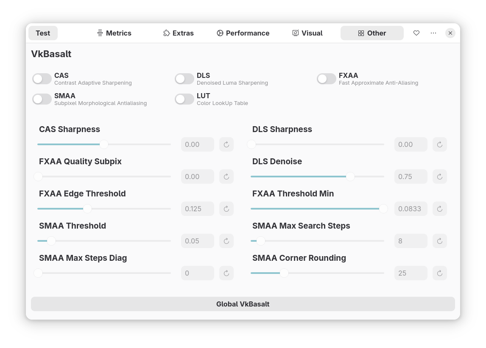

## MangoJuice [](README.md) [](docs/README-ru.md)

### This program will be a convenient alternative to GOverlay for setting up MangoHud

<p align="center">
    
</p>

|               Page 1                |               Page 2                |               Page 3                |               Page 4                |               Page 5                |
| :---------------------------------: | :---------------------------------: | :---------------------------------: | :---------------------------------: | :---------------------------------: |
|  |  |  |  |  |

## Repositories

[](https://repology.org/project/mangojuice/versions)

And also in the repository for [`openSUSE`](https://software.opensuse.org/package/mangojuice)

## Source code build

### Dependencies

#### Build utilities

- `meson`
- `ninja`
- `cmake`
- `gcc`
- `valac`

#### Build requires

- `gtk4`
- `libadwaita-1`
- `gio-2.0`
- `fontconfig`
- `mangohud`

#### Optional dependencies

- `mesa-demos`
- `vulkan-tools`
- `vkbasalt`

### Build

> [!NOTE]
> The functionality is currently being improved.

```shell
meson setup build
```

### Install

```shell
sudo ninja -C build install
```

### Uninstall

```shell
sudo ninja -C build uninstall
```

## Flatpak

### Download Flatpak

[`Nightly build (Main)`](https://github.com/radiolamp/mangojuice/actions/)

### Install Flatpak build

> [WARNING] Attention: for full functionality install MangoHud from Flatpak</span></strong>

```shell
flatpak install --user io.github.radiolamp.mangojuice-x86_64.flatpak
```

### Initial Flatpak support

```shell
flatpak-builder --user --install build-dir build-aux/flatpak/io.github.radiolamp.mangojuice.yml
```
## Devel

Also in the app there is Devel mode. It is intended for development and it is not recommended to use it on a permanent basis. In this mode new features of [mangojuice](https://aur.archlinux.org/packages/mangojuice-git) and [mangohud-git](https://aur.archlinux.org/packages/mangohud-git) versions are tested. If you still want to use it, there is mangojuice-git package in AUR or you can build it yourself with the following command:

```shell
  meson setup build
  meson configure  build --no-pager -Dis_devel=true
  sudo ninja -C build install
```

## Hotkey

|      Hotkey      | Description |
| :--------------: | :---------: |
| [[Ctrl]] + [[Q]] |    Exit     |
| [[Ctrl]] + [[S]] |    Save     |
| [[Ctrl]] + [[E]] |   Save As   |
| [[Ctrl]] + [[R]] |   Restore   |
| [[Ctrl]] + [[T]] |    Test     |

## Support

You can support in several ways:

- Create an issue with a problem or a suggestion for improvement;
- Submit a merge request with a fix or new functionality;
- Support financially (please include your nickname in message when sending via T-Bank).

<br>

<div align="center">
  <a href="https://boosty.to/radiolamp/donate">
    
  </a>
  <a href="https://www.donationalerts.com/r/radiolamp">
  
  </a>
  <a href="https://www.tbank.ru/cf/3PPTstulqEq">
    
  </a>
</div>

## Gratitude

Thank to [Rirusha](https://gitlab.gnome.org/Rirusha) for important clarifications about Vala and GTK4.

### Projects that have become muses

- [`MangoHud`](https://github.com/flightlessmango/MangoHud)
- [`Goverlay`](https://github.com/benjamimgois/goverlay)
- [`Colloid`](https://github.com/vinceliuice/Colloid-icon-theme/)

### Attention, this is my first project on GTK4 + Vala, so please treat with understanding.
